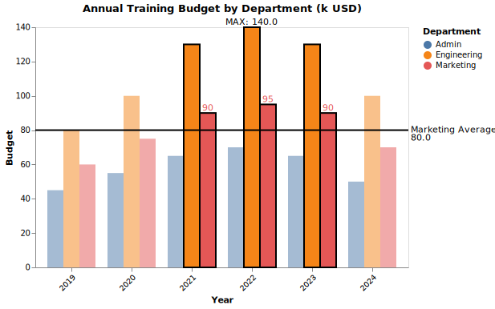

<h1 align="center"> 📈ChartMark：A Structured Grammar for Chart Annotation</h1>

<h4 align="center">  🚧 Please note that this repository is still under construction! 🚧</h4>

Official repository for the paper *"ChartMark: A Structured Grammar for Chart Annotation"*.


## 📖Overview

ChartMark is a **structured, language-agnostic grammar** for chart annotations that cleanly **decouples annotation semantics from visualization implementations**.

It represents both base **chart** properties (e.g., type, axes, data) and a list of annotations in a hierarchical JSON format. Each annotation is defined by its **task** (e.g., highlight, reference, summary), the **data** it uses (e.g., internal data points, derived aggregates, or external content), and the specific **operations** (including **targets** and visual **markers**) needed to realize that task. A toolkit can then **convert** this high-level JSON into executable specs for frameworks like Vega-Lite, ECharts, or D3.js.ChartMark Specification

ChartMark specifications are JSON objects that describe a diverse range of  chart annotaions.、

## 🔨 Convert ChartMark specification to Vega-Lite specification

In this repository, we provide a Python script to convert a ChartMark specification to a Vega-Lite specification.

1. Environment Setup

   ```
   conda create -n chartmark python=3.9
   conda activate chartmark

   pip install -r requirements.txt
   ```
2. Prepare a ChartMark specification (JSON file)

   See `examples/group_bar_chart.json` for a complete example. The file contains both chart definition and annotation specifications following the ChartMark grammar structure.

   ```json
   # Structure of a ChartMark specification (see examples/group_bar_chart.json for details)
   {
     "chart": {
       "title": "Annual Training Budget by Department (k USD)",
       "type": "group_bar",
       "x_name": "Year",
       "y_name": "Budget",
       "classify_name": "Department",
       ...
     },
     "annotations": [
       {
         "task": "highlight",
         "data": { ... },
         "operations": [ ... ]
       },
       ...
     ]
   }
   ```
3. Use the ChartMark converter

   ```python
   from ChartMark import ChartMark

   # Create a ChartMark instance
   chart_mark = ChartMark()

   # Load ChartMark specification from JSON file
   chart_data = chart_mark.load_json('./examples/group_bar_chart.json')

   # Render original chart (without annotations)
   original_spec = chart_mark.render_original_chart(chart_data)
   chart_mark.display_vegalite(original_spec)

   # Render chart with annotations
   annotated_spec = chart_mark.render_annotations(chart_data)
   chart_mark.display_vegalite(annotated_spec)
   ```

## 🎑 Example Results

ChartMark allows you to easily transform ordinary charts into rich, annotated visualizations. For example, the grouped bar chart below adds the following annotation elements through ChartMark:



- Highlighting specific years (2021-2023) and departments (Engineering, Marketing) with opacity and stroke
- Adding data value labels for the Marketing department
- Adding a mean reference line for Marketing department data
- Marking the maximum value data point

These annotation features are implemented through a concise, declarative JSON syntax, without the need to write complex visualization code directly. ChartMark automatically converts these high-level annotations into Vega-Lite specifications and handles all the rendering details of visual elements.
